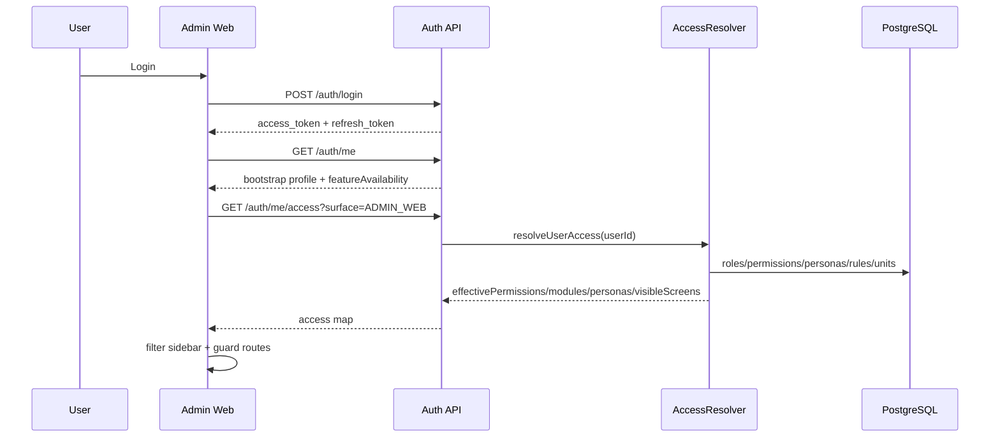
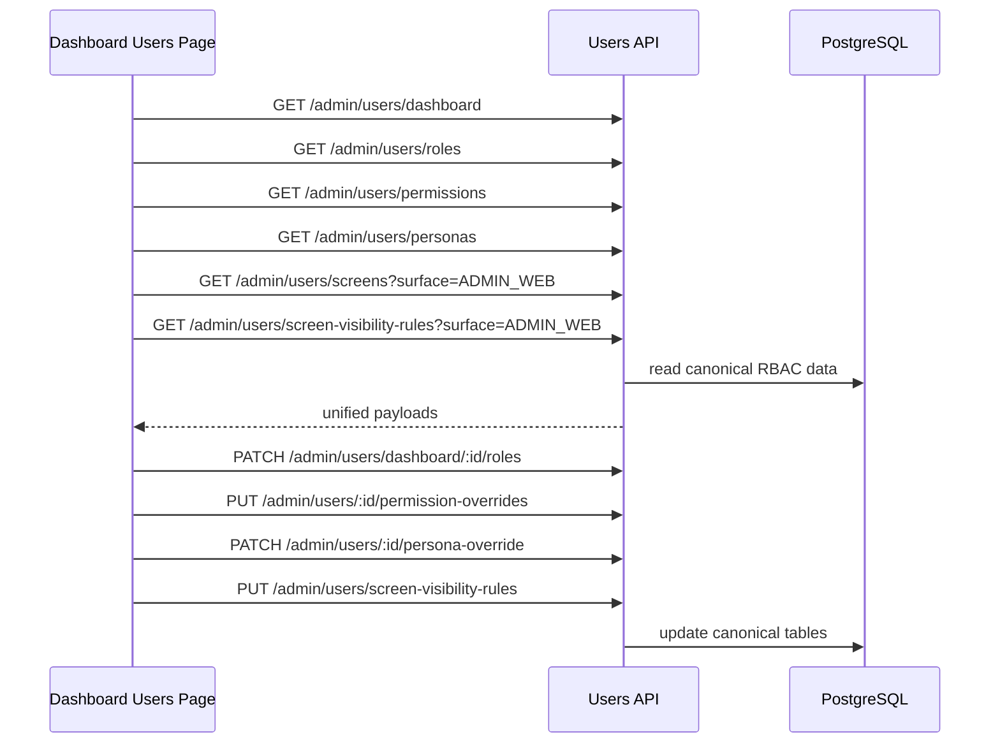
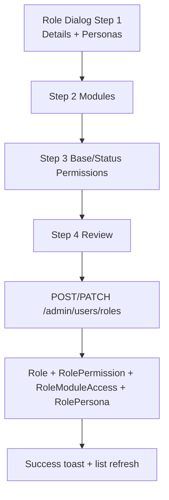
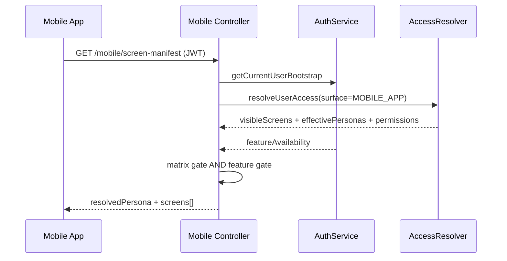

# FLOWS

## 1) Login -> Bootstrap -> UI Access



## 2) Dashboard Users as Single RBAC Control Plane



## 3) Role Creation/Update Flow



## 4) Screen Governance Flow

```mermaid
flowchart TD
  A[Create Persona] --> B[/admin/users/personas]
  C[Create Screen] --> D[/admin/users/screens]
  E[Toggle Matrix Cell
  persona x screen x unitStatus] --> F[Local draft]
  F --> G[PUT /admin/users/screen-visibility-rules]
  G --> H[ScreenVisibilityRule rows replaced for surface]
```

## 5) Mobile Manifest Resolution Flow



## 6) Deprecated/Dropped Duplicate Paths

- Removed compatibility paths:
  - `/admin/system-users*`
  - `/admin/roles*`
- Canonical RBAC endpoints stay under `/admin/users/*`.
