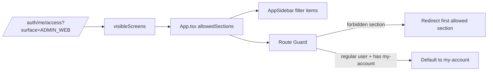
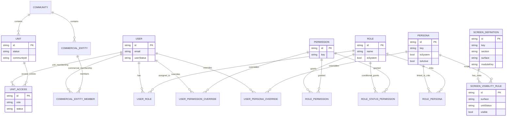

# LOGICAL_DIAGRAMS

## 1) RBAC Access Resolution

```mermaid
flowchart TD
  A[JWT userId] --> B[AccessResolverService.resolveUserAccess]
  B --> C[Load User + Roles + Overrides]
  C --> D[Resolve Effective Permissions]
  D --> E[Resolve Effective Modules]
  C --> F[Resolve Effective Personas]
  C --> G[Resolve Unit Statuses]
  E --> H[Load ScreenDefinition by surface]
  F --> I[Load ScreenVisibilityRule by persona + unitStatus]
  G --> I
  H --> J[Compute visibleScreens]
  I --> J
  D --> K[effectivePermissions[]]
  E --> L[effectiveModules[]]
  F --> M[effectivePersonas[]]
  J --> N[visibleScreens[]]
```

## 2) Admin Web Navigation Gating



## 3) Mobile Screen Manifest Gating

```mermaid
flowchart TD
  A[/mobile/screen-manifest] --> B[getCurrentUserBootstrap]
  A --> C[resolveUserAccess surface=MOBILE_APP]
  C --> D[visibleScreens from matrix]
  B --> E[featureAvailability from auth bootstrap]
  D --> F[Matrix gate]
  E --> G[Feature gate]
  F --> H[Final visible screen list]
  G --> H
```

## 4) Core ERD (RBAC + Governance + Units)


