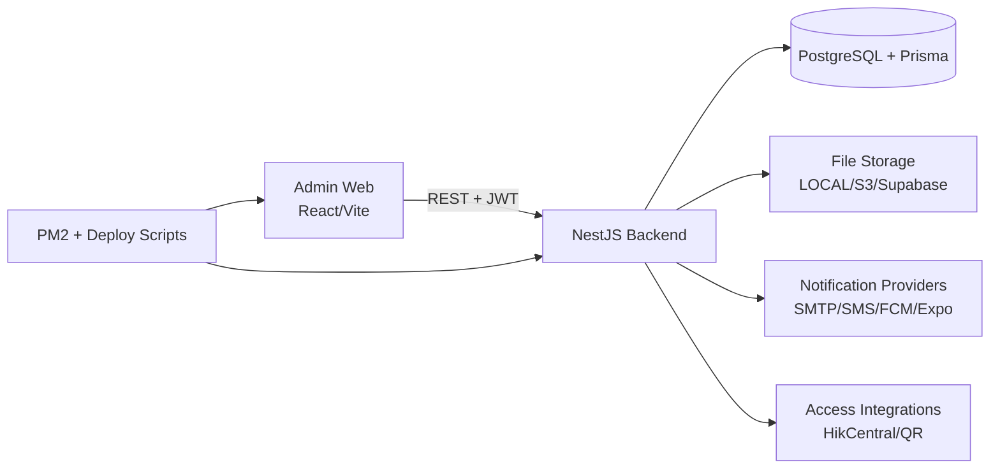
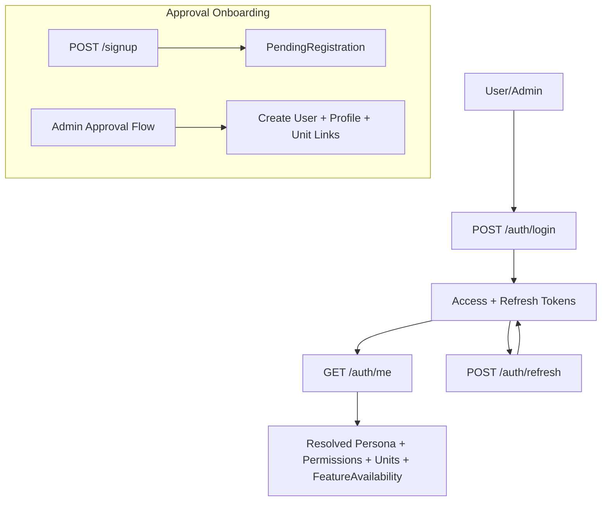
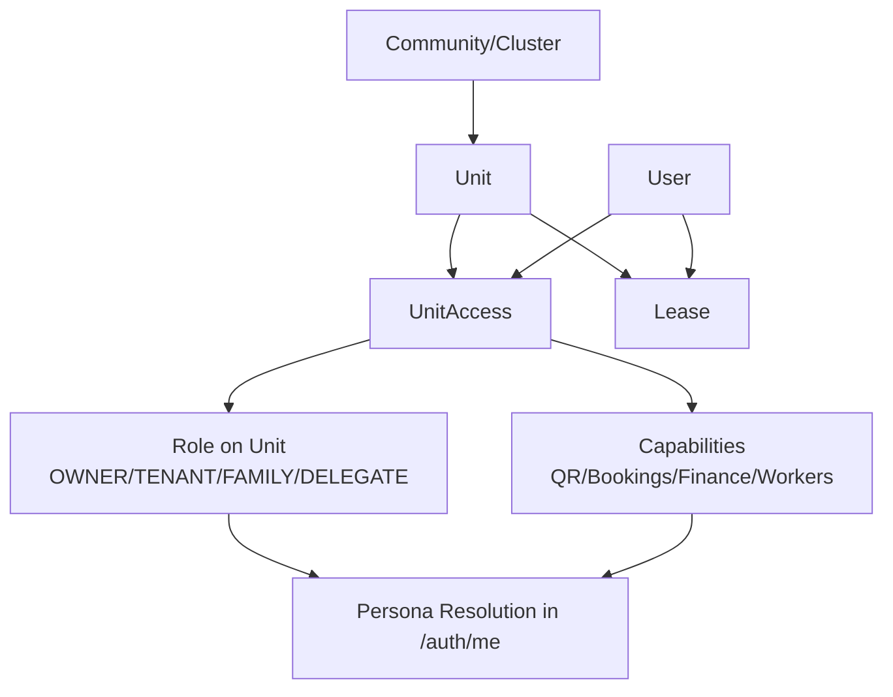
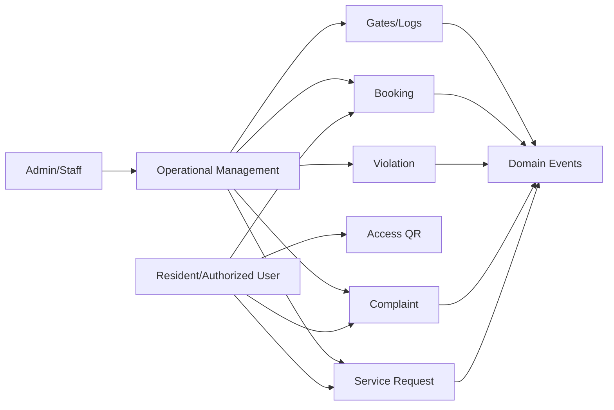
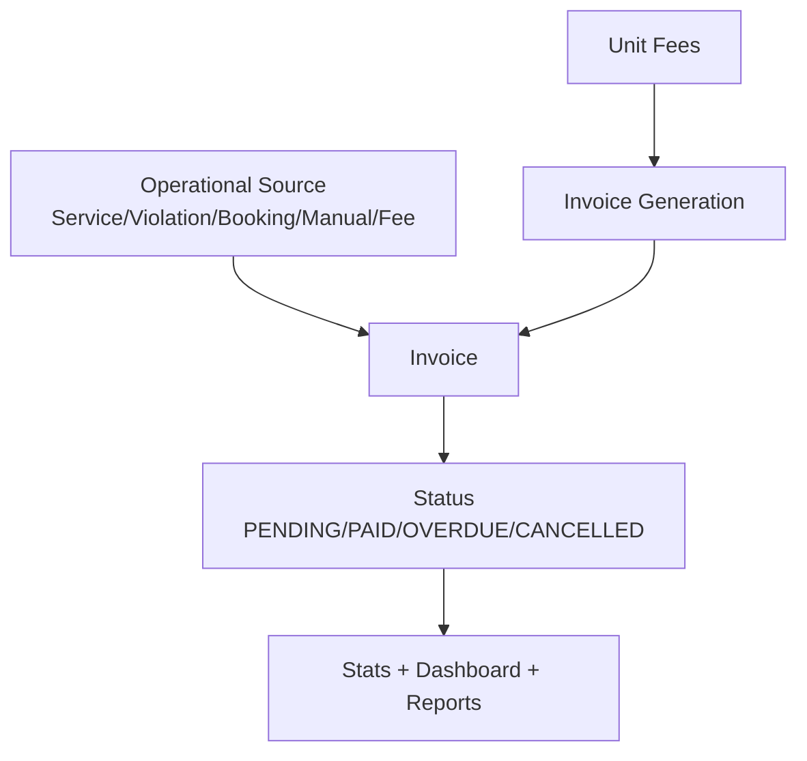
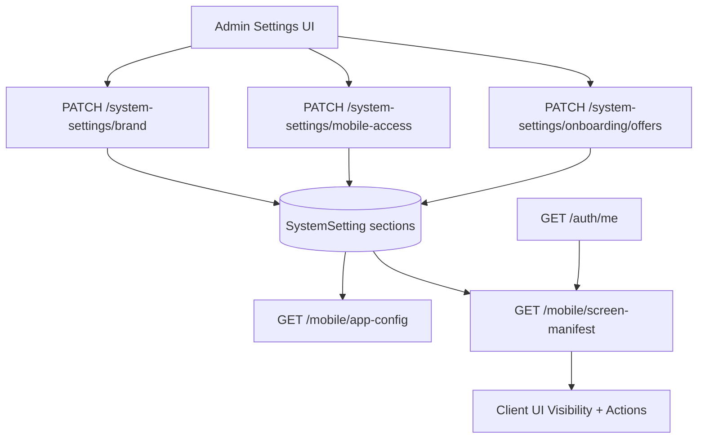
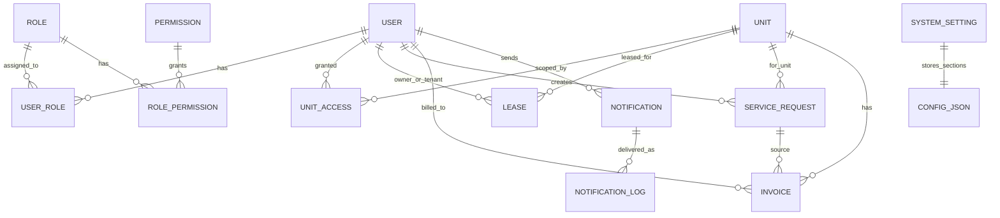

# Logical Diagrams (Backend + Admin)

This document maps system logic for handover and implementation alignment.

## L0) System Context


## L1) Domain Flow - Auth and Identity


## L1) Domain Flow - Property Authority Chain


## L1) Domain Flow - Operations Lifecycle


## L1) Domain Flow - Finance Lifecycle


## L1) Domain Flow - Notifications and Delivery
```mermaid
flowchart TD
  TR[Trigger\n(Admin action or domain event)] --> N[Notification]
  N --> PAY[Payload\nroute/entityType/entityId]
  N --> AUD[Audience + channel rules]
  N --> LOG[NotificationLog records]
  LOG --> CH[Delivery Providers]
```

## L1) Domain Flow - Settings, Branding, Mobile Config


## L2) Data Logic Map (Core Models)


## Manifest Logic Notes
`GET /mobile/screen-manifest` should be treated as the canonical visibility contract for clients.

Inputs:
- `GET /auth/me` output (`resolvedPersona`, `permissions`, `featureAvailability`)
- settings section `mobileAccess`

Outputs per screen:
- screen key
- visibility boolean
- enabled actions
- required permission keys
- persona guards
- feature-flag source
